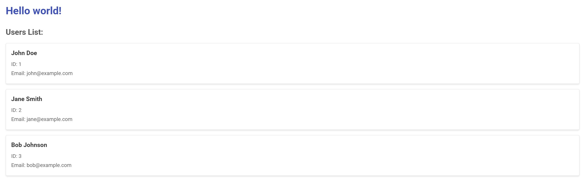

# Nuxt GraphQL Tutorial

A tutorial project demonstrating how to use GraphQL with Nuxt.js, including a complete Docker setup for development.
## Screenshots

### Nuxt Frontend Application



*Nuxt.js frontend application displaying user data retrieved from GraphQL server*

### GraphQL Playground


*GraphQL Playground interface for testing and developing GraphQL queries*

## Features

- Modern frontend application built with Nuxt.js
- Integrated GraphQL using Apollo Client
- Simple GraphQL server implementation
- Complete Docker containerized development environment
- Container network communication

## Technical Stack

- **Frontend**: Nuxt.js 2.x, Vue.js, Vuetify
- **GraphQL Client**: Apollo Client
- **GraphQL Server**: Apollo Server Express
- **Containerization**: Docker, Docker Compose

## Quick Start with Docker

```bash
# Clone the repository
git clone https://github.com/oscar3x39/nuxt-graphql-tutorial.git
cd nuxt-graphql-tutorial

# Start the application with Docker Compose
docker-compose up
```

After running these commands, you can access:
- Nuxt application: http://localhost:3000
- GraphQL server: http://localhost:5000/graphql

## GraphQL Test Queries

In GraphQL Playground (http://localhost:5000/graphql), you can use the following queries to test the API:

### Query Hello Message
```graphql
query {
  hello
}
```

### Query All Users
```graphql
query {
  users {
    id
    name
    email
  }
}
```

### Query Hello Message and All Users
```graphql
query {
  hello
  users {
    id
    name
    email
  }
}
```

## Project Structure

```
├── assets/               # Static assets
├── components/           # Vue components
├── docker-compose.yml    # Docker Compose configuration
├── Dockerfile.nuxt       # Dockerfile for Nuxt application
├── Dockerfile.graphql    # Dockerfile for GraphQL server
├── graphql-server/       # GraphQL server code
├── layouts/              # Nuxt layouts
├── middleware/           # Nuxt middleware
├── pages/                # Nuxt pages
├── plugins/              # Nuxt plugins
├── static/               # Static files
└── store/                # Vuex store
```

## Docker Setup

This project uses Docker Compose to run both the Nuxt.js frontend and the GraphQL server in separate containers:

- **Nuxt.js Container**: Runs the Nuxt.js application on port 3000
- **GraphQL Server Container**: Runs a simple GraphQL server on port 5000

The containers are configured with volume mounts, so your code changes will be reflected in real-time during development.

## Sources
- [Apollo Docs](https://www.apollographql.com/docs)
- [Building GraphQL APIs with Vue.js and Apollo Client](https://stackabuse.com/building-graphql-apis-with-vue-js-and-apollo-client/)

# installation
```
npx create-nuxt-app nuxt-graphql

npm install --save-dev @nuxtjs/vuetify
npm install --save @nuxtjs/axios

npm install --save @nuxtjs/apollo
npm install --save graphql-tag
```

## Setup Configuration in `nuxt.config.js`
``` javascript
buildModules: [
    '@nuxtjs/eslint-module',
    '@nuxtjs/vuetify'
],
modules: [
    '@nuxtjs/axios',
    '@nuxtjs/apollo'
],
apollo: {
    clientConfigs: {
      default: {
        httpEndpoint: "http://localhost:8080/graphql"
      }
    }
}
```

## Creating Queries
> graphql/queries/userQueries

``` javascript
import gql from 'graphql-tag'

export const GET_ALL_USERS_QUERY = gql`
  query getAllUsers {
    getAllUsers {
      // Fields to retrieve
      name
      age
    }
  }
`
```

## Using Mutations
> graphql/queries/userQueries

Much like queries, we can also use mutations by creating a gql-string.

``` javascript
import gql from 'graphql-tag'

export const CREATE_USER_MUTATION = gql`
  mutation createUser($user: UserInput!) {
    createUser(user: $user)
  }
`
```

Our createUser mutation expects a UserInput input, and, to be able to use parameters passed by Apollo. We will first define a variable with the $ called user. Then, the outside wrapper will pass the variable to the createUser mutation, as expected by the server.

## Fragments

In order to keep our gql-type strings tidy and readable, we can use fragments to reuse query logic.

``` javascript
fragment UserFragment on User {
  name: String!
  age: Int!
}

query getAllUsers {
  getAllUsers {
    ...UserFragment
  }
}
```

## Using GraphQL in Vue components

``` javascript
<template>
    <div class="graphql-test">
        <h3 v-if="loading">Loading...</h3>
        <h4 v-if="!loading">{{ getAllUsers }}</h4>
    </div>
</template>

<script>
import { GET_ALL_USERS_QUERY } from '../graphl/queries/userQueries'
export default {
    name: 'GraphQLTest',
    data () {
        return {
            users: []
        }
    },
    async mounted () {
        this.loading = true
        this.users = await this.$apollo.query({ query: GET_ALL_USERS_QUERY })
        this.loading = false
    }
}
</script>
```

If we want to create a user, we can use a mutation:

``` javascript
<template>
    <div class="graphql-test">
        <input v-model="user.name" type="text" placeholder="Name" />
        <input v-model="user.age" placeholder="Age" />
        <button @click="createUser">Create User</button>
    </div>
</template>

<script>
import { CREATE_USER_MUTATION } from '../graphl/queries/userQueries'
export default {
    name: 'GraphQLTest',
    data() {
        return {
            user: {
                name: null,
                age: null
            }
        }
    },
    methods: {
        async createUser () {
            const userCreated = await this.$apollo.mutate({
                mutation: CREATE_USER_MUTATION,
                variables: {
                    user: this.user // this should be the same name as the one the server is expecting
                }
            })
            // We log the created user ID
            console.log(userCreated.data.createUser)
        }
    }
}
</script>
```

Using this approach lets us micro-manage when and where our mutations and queries will execute. Now we will see some other ways of handling these methods that Vue Apollo gives us.

## The Apollo Object

Inside our Vue components, we get access to the Apollo object, which can be used to easily manage our queries and subscriptions:

``` javascript
<template>
    <div class="graphql-test">
        {{ getAllUsers }}
    </div>
</template>

<script>
import { GET_ALL_USERS_QUERY } from '../graphl/queries/userQueries'
export default {
    name: 'GraphQL-Test',
    apollo: {
        getAllUsers: {
            query: GET_ALL_USERS_QUERY
        }
    }
}
</script>
```

## Refetching Queries

When defining a query inside the Apollo object, it is possible to refetch this query when calling a mutation or another query with the refetch method or the refetchQueries property:

``` javascript
<template>
    <div class="graphql-test">
        {{ getAllUsers }}
    </div>
</template>

<script>
import { GET_ALL_USERS_QUERY, CREATE_USER_MUTATION } from '../graphl/queries/userQueries'
export default {
    name: 'GraphQL-Test',
    apollo: {
        getAllUsers: {
            query: GET_ALL_USERS_QUERY
        }
    },
    methods: {
        refetch () {
            this.$apollo.queries.getAllUsers.refetch()
        },
        queryUsers () {
            const user = { name: Lucas, age: 26 }
            this.$apollo.mutate({
                mutation: CREATE_USER_MUTATION,
                variables: {
                    user
                }
                refetchQueries: [
                    { query: GET_ALL_USERS_QUERY }
                ]
            })
        }
    }
}
</script>
```

### Apollo Object Properties

- query: This is the gql type string referring to the query that wants to get triggered.
- variables: An object that accepts the parameters being passed to a given query.
- fetchPolicy: A property that sets the way the query will interact with the cache. The options are cache-and-network, network-only, cache-only, no-cache, standby and the default is cache-first.
- pollInterval: Time in milliseconds that determines how often a query will automatically trigger.

### Special Options

- $error to catch errors in a set handler.
- $deep watches deeply for changes in a query.
- $skip: disables all queries and subscriptions in a given component.
- $skipAllQueries: disables all queries from a component.
- $skipAllSubscriptions: to disables all subscriptions in a component.

## Apollo Components

- ApolloQuery
``` javascript
<ApolloQuery
  :query="GET_ALL_USERS_QUERY"
>
    <template slot-scope="{ result: { loading, error, data } }">
        <!-- Loading -->
        <div v-if="loading">Query is loading.</div>

        <!-- Error -->
        <div v-else-if="error">We got an error!</div>

        <!-- Result -->
        <div v-else-if="data">{{ data.getAllUsers }}</div>

        <!-- No result (if the query succeed but there's no data) -->
        <div v-else>No result from the server</div>
    </template>
</ApolloQuery>
```

- ApolloMutation

``` javascript
<ApolloMutation
  :mutation="CREATE_USER_MUTATION"
  :variables="{
    name,
    age
  }"
  @done="mutationFinished"
>
    <template slot-scope="{ mutate, loading, error }">
        <!-- Loading -->
        <h4 v-if="loading">The mutation is loading!</h4>

        <!-- Mutation Trigger -->
        <button @click="mutate()">Create User</button>

        <!-- Error -->
        <p v-if="error">An error has occurred!</p>
    </template>
</ApolloMutation>
```